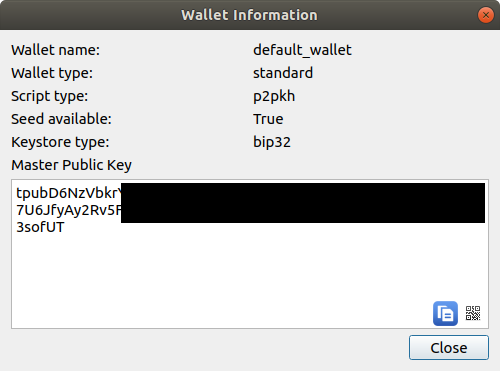

# docker-eps
docker-compose made of bitcoind and eps, for maximum simplicity

## how to run
Get the `masterpubkey` in Electrum: Wallet > Information

```
export NETWORK=mainnet #or testnet
export MASTERPUBKEY=xpub...
docker-compose up
```
That's all! Then you only have to set the server in Electrum to `127.0.0.1:50002`, and you're done!

The `Dockerfile` and `launch.py` files are given if you want to make your own version. 
